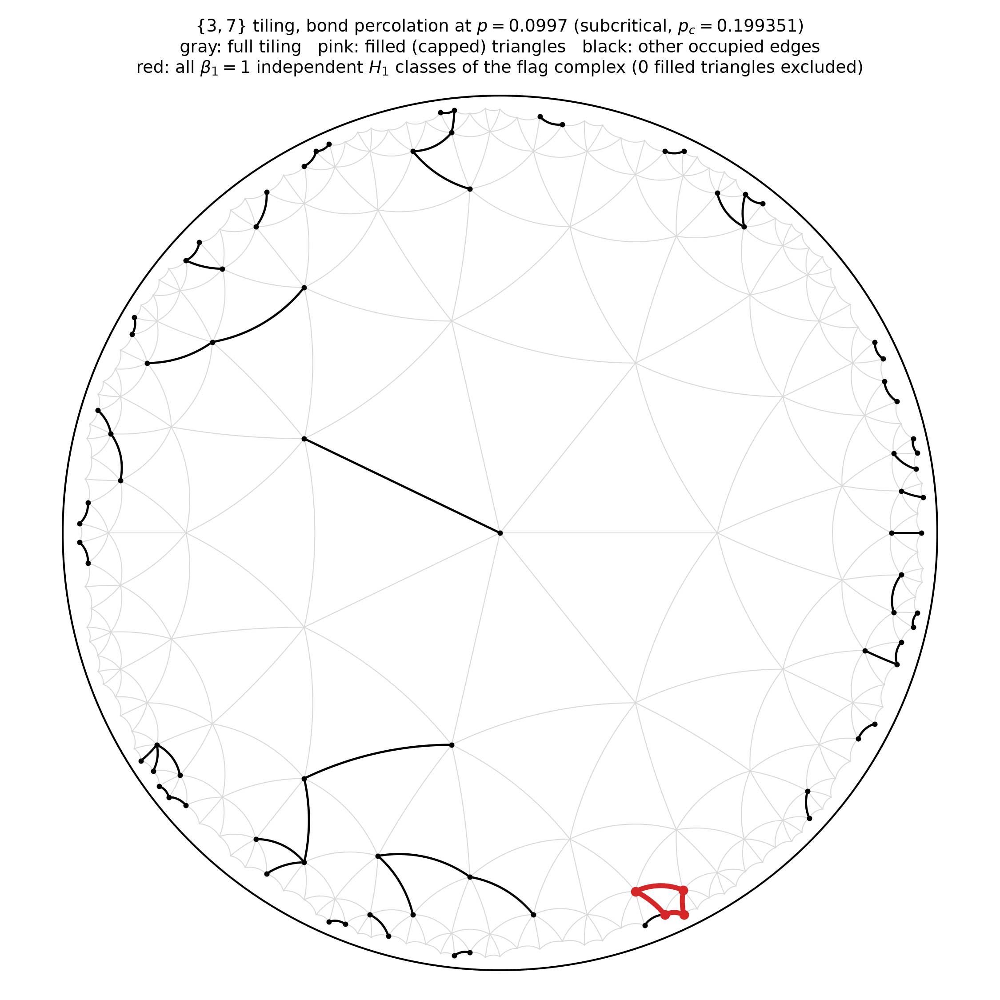
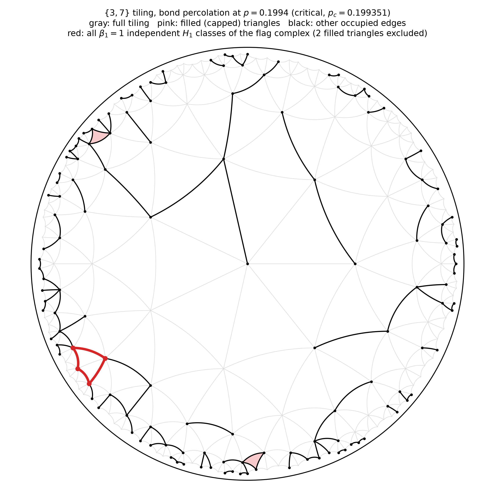
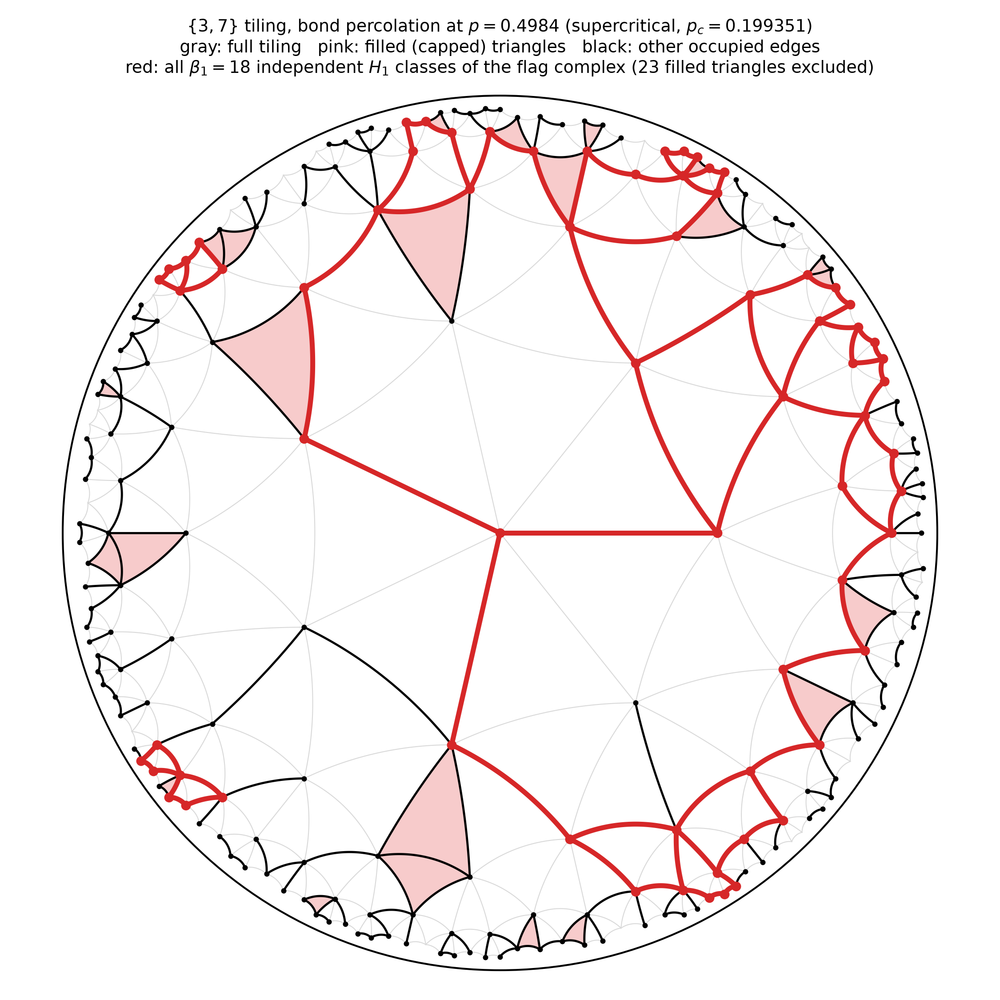
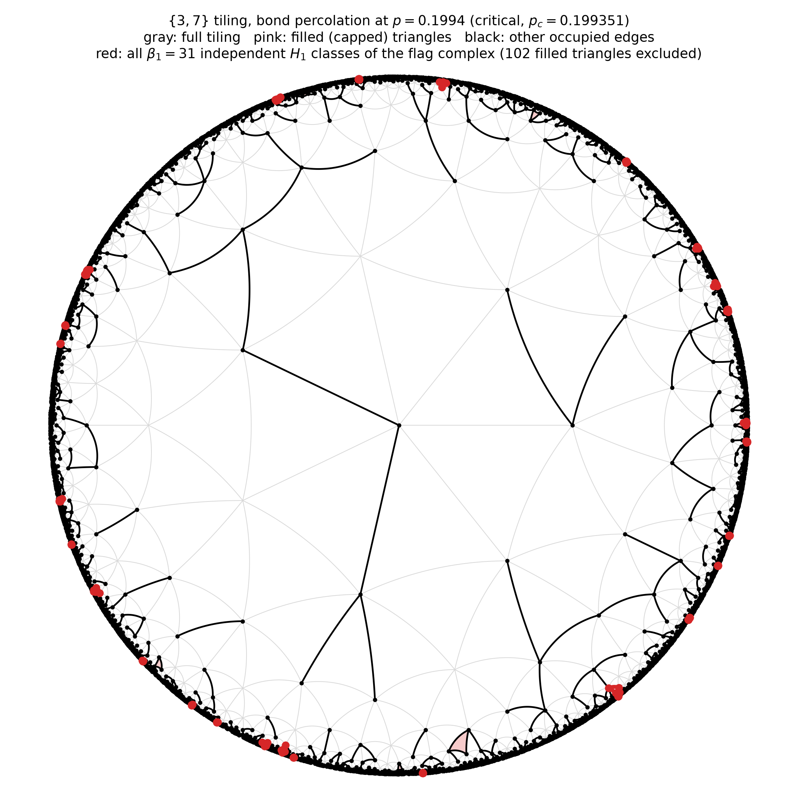
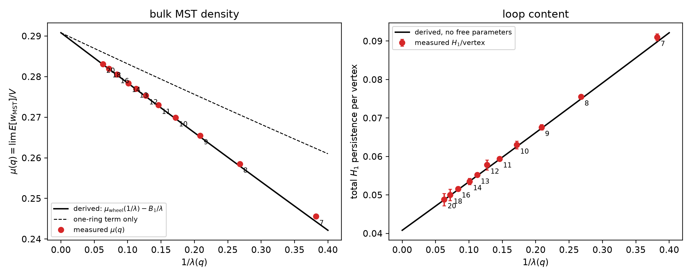

# Persistent homology of percolation complexes on {3,q} tilings

Bond percolation on disk-shaped patches of the regular hyperbolic triangle
tilings {3,q}, q >= 7, studied through the persistent H1 of the associated
flag complex. The main result is a derivation, with no fitted parameters, of
the total persistent H1 per vertex as a function of the tiling's growth rate
lambda(q). The paper is in [`paper/`](paper/); this file summarizes the
result, the repository layout, and how to reproduce each piece.

---

## The result in one paragraph

Let lambda(q) = ((q-4) + sqrt((q-4)^2 - 4)) / 2 be the asymptotic ratio of
successive ring sizes in the ring-growth construction of {3,q}. Assign each
edge an i.i.d. Uniform[0,1] threshold, build the flag complex as a filtration
in the threshold, and let H1/V be the total persistent H1 (summed bar length)
per vertex. Then

    H1/V  =  mu_wheel(1/lambda) - B1/lambda - 1/4 + 1/(4 lambda) + O(1/lambda^2)

with

    mu_wheel(a)   = int_0^1 (1-p)^3 (1-ap) / (1 - p(1-p)(1-ap)) dp
    mu_wheel(0)   = 3/2 - 2 pi / (3 sqrt 3)  =  0.29080
    B1            = 0.04713   (explicit rational integrand, see paper)

so that the large-curvature intercept is 5/4 - 2 pi / (3 sqrt 3) = 0.04080.
Measured against the eleven values q = 7, 8, ..., 14, 16, 18, 20, the formula
matches to rms 0.0005, every point within its own realization spread. A
straight line fitted to the derived curve is 0.0406 + 0.1286/lambda; the
empirical two-parameter fit is 0.0404 + 0.1316/lambda. The linear-in-1/lambda
form is an output of the derivation, not an assumption.

The derivation has three parts, each checked separately by simulation:

1. **Exact identity.** Because the complex is a triangulated disk, beta2 = 0
   and the Euler characteristic gives, per realization, total H1 persistence
   = w_MST - sum_e u_e + sum_t max(u over t), where w_MST is the weight of the
   minimum spanning tree under the same thresholds. Verified to 1e-12 against
   GUDHI. In expectation this is E[w_MST] - b/4 with b the boundary edge
   count, and b/V -> 1 - 1/lambda from the ring recursion.
2. **The one-ring term.** Attaching ring n to a contracted interior turns
   E[w_MST]/V into a percolation calculation on a cycle with spokes. Each ring
   vertex has one spoke inward (e-type) or two (v-type). The v-type count is
   exactly v_n = rc[n-1] (ring n-1 is a cycle; each adjacent pair shares one
   child), so the fraction is rc[n-1]/rc[n] -> 1/lambda(q). The arrangement
   around a ring is periodic with period rc[n]/q, the fundamental domain of
   the q-fold rotational symmetry, and balanced within a period. A renewal sum
   gives mu_wheel.
3. **The bridging correction.** The outermost ring (a 1 - 1/lambda fraction of
   the disk) attaches exactly. In an inner ring, two spoke-free runs on either
   side of an absent rim edge can be joined through the ring outside, via the
   child they share. That happens with probability beta(p) = (p/(1-p+p^2))^2,
   and integrating the resulting overcount gives B1.

Details, tables, and the checks on each step are in
[`paper/curvature-percolation-homology.pdf`](paper/curvature-percolation-homology.pdf).

---

## Figures

The {3,7} tiling to ring 4 under bond percolation at four occupation
probabilities, drawn with hyperbolic geodesics. Gray: full tiling. Black:
occupied edges. Pink: triangles with all three edges occupied, which the flag
complex fills in. Red: a basis for H1 of the flag complex (cycle space of the
occupied graph modulo filled-triangle boundaries).

| p = 0.10 | p = 0.20 (p_c) |
|---|---|
|  |  |

| p = 0.30 | p = 0.50 |
|---|---|
|  |  |

The critical draw at ring 8 (V = 11,173) carries 31 independent H1 classes,
almost all on the outermost ring, which holds 62% of the vertices at q = 7.
Loop density at p_c is about 0.003 per vertex and stable from ring 7 onward,
so the single loop in the ring-4 critical panel is a small-sample effect.

The derived law against measurement, no fitted curves:

---

## Repository layout

    paper/               LaTeX source, bibliography, compiled PDF, outline;
                         the earlier proposal.* draft is kept for reference
    figures/             all rendered figures used by the paper and this README
    results/             measured data: sweep_results.json (H1 sweep),
                         mu_q_results.json (MST density), q6_convergence_*.json,
                         pc_window_results.json, poincare_percolation_meta.json,
                         sae_results.json, Betti-curve .npy files
    src/                 library code, no entry points:
                           mesh_topology.py        {3,q} ring-growth graph and face list
                           hyperbolic_lattice.py   Mertens-Moore vertex labeling (cross-check)
                           percolation_topology.py filtered flag complex, GUDHI persistence
                           hyperbolic_layout.py    exact Poincare-disk placement via isometries
                           euclidean_lattice.py    flat q = 6 control
                           generate_clusters.py, brw_embedding.py, sae.py,
                           feature_splitting.py    the embedding pipeline (future work)
    experiments/         scripts that produce results/:
                           full_sweep.py           H1 per vertex across q and ring depth
                           mu_q_convergence.py     MST density mu(q) to N ~ 2e6
                           q6_convergence.py       flat-case finite-size study
                           pc_window_check.py      share of H1 persistence near p_c
                           pc_ring_scan.py         beta_1(p_c) vs ring depth
                           xstar_check.py          v-type fraction = 1/lambda, verified
                           vtype_pattern.py        ring pattern: period rc[n]/q, balanced
                           mu_derivation_check.py  one-ring term vs measurement
                           mu_derivation_sturmian.py  balanced vs i.i.d. pattern (negligible)
                           mu_residual_structure.py   inner-ring overcount by simulation
                           bridging_diagnose.py    beta(p) and the accounting, separately
                           mu_full_derivation.py   the complete formula vs all q
                           sae_experiment.py       local driver for the embedding pipeline
    plots/               scripts that produce figures/
    campaign/            GPU runner and outputs for the embedding pipeline
    embedding_capacity/  a separate project on embedding {3,q} into R^d
                         (Hessian spectrum, ring-6 energy experiment); kept
                         here because it shares src/, written up elsewhere

Every script in `experiments/`, `plots/`, `campaign/`, and
`embedding_capacity/` starts with `from _paths import ...`, which puts `src/`
on the path and resolves `results/` and `figures/` as absolute directories,
so scripts can be run from any working directory.

## Running

Python 3.11+ with `numpy`, `scipy`, `networkx`, `gudhi`, `matplotlib`; the
embedding pipeline also needs `torch`.

    python experiments/xstar_check.py          # v-type fraction, seconds
    python experiments/mu_full_derivation.py   # derived mu(q) vs measured, seconds
    python plots/figure_derived_law.py         # regenerates figures/figure_derived_law.png
    python plots/figure_poincare_percolation.py   # the four ring-4 renderings, ~1 min
    python experiments/pc_ring_scan.py         # beta_1(p_c) vs ring depth, ~1 min
    python experiments/full_sweep.py           # the H1 sweep, minutes
    python experiments/mu_q_convergence.py     # MST density to N ~ 2e6, minutes on a workstation

To compile the paper:

    cd paper && pdflatex curvature-percolation-homology && bibtex curvature-percolation-homology \
      && pdflatex curvature-percolation-homology && pdflatex curvature-percolation-homology

---

## Notes on scope

**q = 6 is excluded.** The flat triangular lattice is the lambda = 1 boundary
of the family: ring sizes grow linearly, the boundary fraction goes to zero
instead of to 1 - 1/lambda, and the 1/lambda expansion has no small
parameter. It also converges only as a power law in N (about N^-0.45, needing
~10^6 vertices for three figures) where every hyperbolic q is converged to a
percent by 10^4. Its data are kept in `results/` and `experiments/q6_convergence.py`.

**Criticality is not what is measured.** The tilings are nonamenable and
percolation on them is mean-field at p_c, but total persistent H1 integrates
over all p and is dominated by p well above threshold: a window [p_c/2, 2p_c]
captures under 5% of the total at q = 7 and under 0.01% by q = 20
(`experiments/pc_window_check.py`). The derivation never uses critical-point
theory.

**What is open.** The O(1/lambda^2) term, numerically about -0.01/lambda^2,
collects bridging through two rings and correlations between neighboring
bridges; both are local calculations of the same kind as beta(p).

---

## Future work: embedding into vector space

A natural follow-on asks whether the same suppression of loop content
survives once clusters are embedded (branching random walk along a spanning
tree) and fed to a sparse autoencoder, measured by cycle inconsistency and
feature splitting. The pipeline exists (`src/brw_embedding.py`, `src/sae.py`,
`src/feature_splitting.py`, `campaign/`). Two preliminary runs at different
scales agreed on direction but not magnitude, and the configuration needs to
be fixed and rerun before any numbers are reported; the paper describes the
approach as work in progress and does not report those results.

---

## References

Hutchcroft, T. (2019). Percolation on hyperbolic graphs. *GAFA*, 29, 766-810. arXiv:1804.10191.

Mertens, S., and Moore, C. (2017). Percolation thresholds in hyperbolic lattices. *Phys. Rev. E*, 96, 042116. arXiv:1708.05876.

Bobrowski, O., and Skraba, P. (2020). Homological percolation and the Euler characteristic. *Phys. Rev. E*, 101, 032304. arXiv:1910.10146.

Frieze, A. M. (1985). On the value of a random minimum spanning tree problem. *Discrete Applied Mathematics*, 10, 47-56.

Aldous, D., and Steele, J. M. (2004). The objective method: probabilistic combinatorial optimization and local weak convergence. In *Probability on Discrete Structures*, Springer.

Nickel, M., and Kiela, D. (2017). Poincare embeddings for learning hierarchical representations. *NeurIPS*.

Brill, A. (2024). Neural scaling laws rooted in the data distribution. arXiv:2412.07942.

Brill, A. (2025). Representation learning on a random lattice. arXiv:2504.20197.
