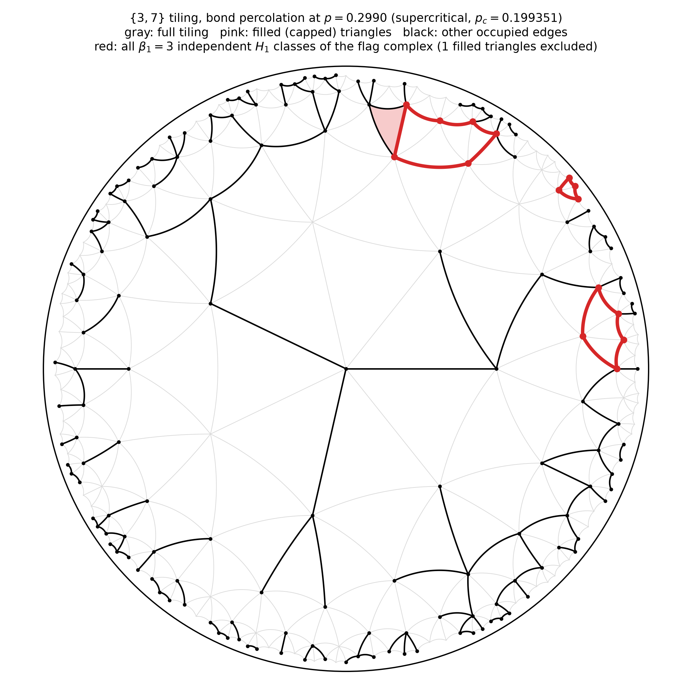
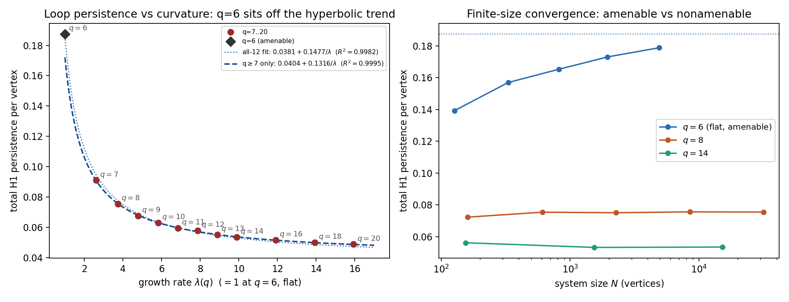

# Curvature-Filtered Persistent Homology of Percolation Complexes

A study of how negative curvature suppresses loop content in percolation clusters,
and whether that suppression leaves a measurable signature in sparse autoencoders
trained on branching-random-walk embeddings of those clusters.

---

## Context: Brill's data model

Brill (2024, 2025) models a natural data distribution as the cluster process of
critical bond percolation on a high-dimensional lattice.  The key analytical
simplification is that, in high dimensions, random paths almost never
self-intersect, so percolation clusters are essentially trees: they contain
negligible H1 (independent cycles) and can be replaced by a Bethe lattice for
exact computation of thresholds and critical exponents.  Brill's hierarchical
fine-graining algorithm then generates synthetic data by embedding those clusters
into a vector space via a **branching random walk (BRW)**: each node's feature
vector is the cumulative sum of i.i.d. Gaussian steps along the unique path from
the cluster root, so the embedding exactly preserves the tree metric and any
departures from it (loops in the cluster) appear as inconsistencies in the
embedded coordinates.

This project asks two questions in that setting:

1. **Homological question.** How accurately does curvature serve as a substitute
   for high dimension in suppressing cluster loops, and does that suppression
   follow a closed-form law?

2. **SAE question.** When synthetic clusters are BRW-embedded and fed to a sparse
   autoencoder, does the SAE's feature-splitting behavior track the loop content
   of the underlying clusters?

---

## Approach: {3, q} tilings as a curvature dial

The regular triangulation **{3, q}** — q triangles meeting at every vertex — gives
an exact, one-parameter family spanning the loop-rich-to-tree-like spectrum:

| q  | geometry | amenable? | λ(q) |
|----|----------|-----------|------|
| 6  | flat (Euclidean triangular lattice) | yes | 1 |
| 7  | mildly hyperbolic | no | 2.618 |
| 8  | more hyperbolic | no | 3.732 |
| 12 | strongly hyperbolic | no | 8.873 |
| 20 | deep hyperbolic | no | 17.944 |

λ(q) = [(q − 4) + √((q − 4)² − 4)] / 2 is the dominant root of the ring-count
recursion rc[n] = (q − 4)·rc[n − 1] − rc[n − 2]; it is the tiling's asymptotic
per-ring growth rate.  For this specific family, λ(q) = 1 (linear growth) versus
λ(q) > 1 (exponential growth) is exactly the amenable/non-amenable distinction.

Non-amenable hyperbolic graphs are provably in the mean-field universality class
at p_c (Hutchcroft, GAFA 2019), for the same structural reason high-dimensional
Euclidean percolation is: boundary scales with volume, so the "loops are rare"
argument holds globally rather than only asymptotically in dimension.

Bond percolation on each {3, q} lattice is run as a filtered simplicial complex
(each edge assigned an i.i.d. Uniform[0, 1] threshold; 2-simplices added wherever
all three boundary edges are present), and GUDHI extracts persistent H1 across the
full filtration from a single draw of thresholds.

### {3,7} under bond percolation, visualized

Poincaré-disk renderings of the {3,7} tiling (ring 4, N = 232) at four bond
occupation probabilities, every edge drawn as a true hyperbolic geodesic arc.
**Pink** marks triangles whose three edges are all occupied — these get a
2-simplex filled in by the same construction as the persistent-homology
pipeline above, so their boundary is trivial in H1, not a loop. **Red** marks
a genuine basis for H1 of the flag complex, computed by Gaussian elimination
over GF(2) on the graph's cycle space modulo the subspace spanned by
filled-triangle boundaries — so a bare occupied triangle is correctly
excluded rather than miscounted as a loop.

| Subcritical (p ≈ 0.5 p<sub>c</sub>) | Critical (p = p<sub>c</sub>) |
|---|---|
|  |  |

| Supercritical (p ≈ 1.5 p<sub>c</sub>) | Supercritical (p ≈ 2.5 p<sub>c</sub>) |
|---|---|
|  |  |

Loop content is visibly a bulk/supercritical phenomenon here, not a critical
one: at p_c only a handful of small, isolated loops survive near the
boundary, while well above p_c loop content spreads across most of the
tiling — consistent with `pc_window_check.py`, which finds that a window
around p_c captures 53% of total H1 persistence at the amenable q = 6 point
but under 0.01% by q = 20. Exact vertex placement is via `hyperbolic_layout.py`,
which re-orients the triangulation's face list consistently and composes
hyperbolic isometries — verified to ~1e-14 edge-length error through ring 5.
See `figure_poincare_percolation.py`.

---

## Finding 1 — H1 persistence follows a closed-form scaling law

Using each q's largest available system size — for q = 6, the converged
large-N asymptote from Finding 2, since raw sweep sizes for q = 6 have not
fully converged at any practical ring depth — **total H1 persistence per
vertex** (sum of bar lengths in the persistence diagram, divided by N) fits:

```
H1/vertex  =  0.0381  +  0.1477 / λ(q),    R² = 0.9982
```

| q  | N         | H1/vertex        | 1/λ(q) |
|----|-----------|------------------|--------|
| 6  | 3,003,001 | 0.18757 ± 0.00034| 1.000  |
| 7  | 29,261    | 0.0910 ± 0.0009  | 0.382  |
| 8  | 31,809    | 0.0755 ± 0.0005  | 0.268  |
| 9  | 30,025    | 0.0676 ± 0.0007  | 0.207  |
| 10 | 14,351    | 0.0630 ± 0.0010  | 0.170  |
| 11 | 29,041    | 0.0594 ± 0.0004  | 0.143  |
| 12 |  6,817    | 0.0578 ± 0.0013  | 0.113  |
| 13 | 10,414    | 0.0552 ± 0.0004  | 0.097  |
| 14 | 15,261    | 0.0535 ± 0.0008  | 0.085  |
| 16 | 29,761    | 0.0516 ± 0.0006  | 0.068  |
| 18 |  3,781    | 0.0500 ± 0.0015  | 0.057  |
| 20 |  5,441    | 0.0488 ± 0.0016  | 0.050  |

The intercept (~0.038) is a curvature-independent floor from purely local loop
content; the 1/λ term captures everything global curvature suppresses, decaying
at the tiling's own per-ring growth rate — the same quantity that governs the
amenable/non-amenable transition. This inverts directly: given a target
loop-persistence value, solve for λ and hence q, picking off the curvature
needed to hit any specified distance from the treelike limit.

This split is not just a fitting convenience — it is close to a real mechanistic
decomposition. See Finding 5 below for the derivation: the boundary-edge fraction
of the lattice provably obeys $b/V \to 1-1/\lambda(q)$, which by itself produces a
$1/\lambda$ term with a derived coefficient of exactly $1/4$. Since the fitted
slope (0.1477) is smaller than $1/4$, the remaining "bulk" contribution
(expected minimum-spanning-tree weight per vertex) must carry its own,
partially-canceling $\lambda$-dependence — confirmed directly in Finding 5.
See `figure3_scaling_law_final.py`.



**q = 6's leverage on this fit is real, and informative rather than a flaw.**
q = 6 is the family's only amenable (λ = 1) point, sitting at 1/λ = 1 versus
1/λ ∈ [0.05, 0.38] for every hyperbolic q tested — extreme leverage in a
12-point regression. Refitting with only the eleven hyperbolic points (q ≥ 7)
gives an *even tighter* law:

```
H1/vertex  =  0.0404 + 0.1316/λ(q),    R² = 0.9995   (vs 0.9982 for all twelve)
```

Extrapolating this hyperbolic-only trend to λ = 1 predicts H1/vertex(6) = 0.1721
— 0.0155 below the actual converged value (0.18757 ± 0.00034), a gap ~45× the
asymptote's own uncertainty, not noise. This isn't a fitting artifact: q = 6 is
the family's unique amenable/parabolic case, and Finding 2 already showed it
converges qualitatively differently from every hyperbolic q. Finding 5 traces
this gap to its exact source and confirms it independently.

---

## Finding 2 — Finite-size convergence splits cleanly at the amenability boundary

- **q = 6 (amenable):** converges, but far more slowly than any hyperbolic q —
  roughly 1000x the vertex count is needed to reach the same relative precision.
- **q ≥ 7 (non-amenable):** every value converges to within 1–2 % within the first
  few ring depths and stays flat across two orders of magnitude in N.

This is an empirical fingerprint of the isoperimetric distinction at the heart of
Hutchcroft's theorem: non-amenable graphs have boundary scaling with volume, so
finite-size corrections decay fast; amenable graphs do not.

For q = 6, H1/vertex(N) fits cleanly to a power-law approach to a finite
asymptote, run out to N ≈ 3.00 million (rings = 1000; 8–15 percolation draws per
size across seven ring depths beyond the original sweep):

```
H1/vertex(N)  =  A − B / N^α
A     = 0.18757 ± 0.00034
B     = 0.4164  ± 0.0266
α     = 0.4453  ± 0.0129     (R² = 0.9988)
```

A is the converged asymptote used for q = 6 throughout this document. The fitted
exponent α ≈ 0.445 is close to the 1/√N perimeter-to-area ratio expected for a 2D
disk of N vertices, though not an exact match (~4σ away from exactly 1/2).
See `q6_convergence.py`, `figure_q6_convergence.py` / `figure_q6_convergence.png`.

---

## Finding 3 — BRW cycle inconsistency directly tracks loop content

Each subcritical percolation cluster is BRW-embedded: a BFS spanning tree is
chosen, each edge receives an i.i.d. Gaussian step in ℝ⁶⁴, and node coordinates
are cumulative sums along the unique tree path.  For non-tree (cycle-closing) edges
the implied coordinate difference is generally nonzero; the **cycle inconsistency**
is the RMS norm of these holonomy vectors over all non-tree edges in the cluster.

Running at p ≈ 0.75 p_c for each q (subcritical, finite clusters; 300 clusters per
q, balanced for equal training budget):

| q  | p     | cycle inconsistency |
|----|-------|---------------------|
|  7 | 0.150 | 0.237               |
|  8 | 0.120 | 0.113               |
| 12 | 0.085 | 0.081               |
| 20 | 0.047 | 0.045               |

**Perfectly monotone.** This is a direct embedding-space measurement: BRW is exact
on trees, so tree-like clusters (high q) produce near-zero inconsistency and loopy
clusters (low q) produce larger holonomy.  The metric is zero-assumption — it
requires no homology computation, just the embedding coordinates and the knowledge
of which edges are non-tree.

---

## Finding 4 — SAE feature splitting tracks loop content, and correlates with H1

A sparse autoencoder (ReLU encoder, unit-norm decoder columns, L1 sparsity penalty)
is trained on the pooled BRW node embeddings for each q.  The **feature-splitting
score** is the number of dictionary atoms needed, via greedy argmax cover, to
account for ≥ 90 % of cluster-node memberships — averaged over clusters.

With equal, balanced training data (2000 clusters/q, dict size 1024, 300 epochs,
d = 128; GPU campaign on lambda01):

| q  | n clusters | feature-splitting score | cycle inconsistency | H1/vertex |
|----|-----------|--------------------------|----------------------|-----------|
|  7 | 2000      | 4.837 ± 1.393            | 0.2775               | 0.0910    |
|  8 | 2000      | 4.798 ± 1.348            | 0.1940               | 0.0755    |
| 12 | 2000      | 4.714 ± 1.274            | 0.0986               | 0.0578    |
| 20 | 2000      | 4.566 ± 1.180            | 0.0297               | 0.0488    |

**Monotone, in the expected direction:** more loopy clusters (low q) require more
dictionary atoms to cover the same fraction of node memberships — the SAE splits
their "loop-cluster" feature across more atoms. Per-cluster scores are noisy
(SD ≈ 1.2–1.4), but at n = 2000 clusters/q the standard error of the mean is
tiny (≈ 0.03): the q = 7 vs q = 20 difference is significant at p = 3.4×10⁻¹¹
(Welch t-test), and the pooled Spearman correlation across all 8000 cluster-level
scores is ρ = −0.065, p = 5×10⁻⁹ — a small effect size, but clearly real rather
than noise. See `campaign/figure_feature_splitting_campaign.py` for a figure that
separates the honest per-cluster spread from the precision of the mean.

The aggregate (per-q) feature-splitting mean also regresses directly against H1
persistence per vertex: Pearson r = 0.93 (p = 0.07) against H1/vertex, and
r = 0.95 (p = 0.048) against cycle inconsistency — only 4 degrees of freedom, so
these p-values are marginal, but the relationship is close to linear rather than
merely ordinal.

*Implementation note:* the cluster counts per q must be equalized before training.
Without subsampling, low-q lattices (more clusters at matched lattice sizes) train
a tighter SAE basis, spuriously lowering their apparent splitting score.

---

## Finding 5 — Finding 1's scaling law splits into a proven term and an open one

Because the percolation complex is a triangulated disk, β₂(p) = 0 identically (a
2-complex only carries an H2 class around a genuine void, which needs a closed
surface), so the Euler characteristic χ(p) = N − E(p) + F(p) satisfies
χ(p) = β₀(p) − β₁(p) exactly at every threshold p. "Total H1 persistence" is
∫₀¹β₁(p)dp — the area under the loop-density curve — so integrating this identity
term by term gives, for a single percolation realization (no expectation needed):

```
∫₀¹ β₁(p) dp  =  w_MST − Σ_e u_e + Σ_t max(edges of t)
```

where w_MST is the weight of the graph's minimum spanning tree under the edge
thresholds u_e (using the classical single-linkage/Kruskal fact that N−β₀(p)
equals the number of MST edges with weight ≤ p), and the sum over t runs over
triangular faces. This was checked directly against the GUDHI pipeline output
({3,7}, ring depth 5, N = 617) and matches to floating-point precision (10⁻¹²).

Taking expectations (E[u_e] = 1/2, E[max of 3 uniforms] = 3/4) and using Euler's
formula together with the disk's face structure (E_tot = 3V−3−b, F_tot = 2V−2−b,
where b is the number of boundary edges) collapses this to:

```
E[total H1 persistence]  =  E[w_MST]  −  b/4
```

Both terms are now purely graph-theoretic. b is exactly countable from the
lattice's combinatorics, and b/V → 1 − 1/λ(q) as V→∞ — a direct, provable
consequence of the same ring-count recursion that produces λ(q), since ring sizes
grow geometrically and the outer ring becomes a fixed fraction of the total.
Confirmed numerically to four decimal places already at V ~ 10³–10⁴. This alone
contributes a term −1/4 + 1/(4λ(q)) to H1 persistence per vertex: a real 1/λ
effect, with a derived coefficient of exactly 1/4.

That coefficient (1/4 = 0.25) is larger than Finding 1's fitted slope (0.1477),
which means the remaining "bulk" term, μ(q) := lim E[w_MST]/V, is not itself
constant in q. Since MST weight needs no persistent-homology computation (just
Kruskal via `scipy.sparse.csgraph`), μ(q) can be pushed to much larger N than
H1 itself — up to N ≈ 2 million per q, across all twelve q values
(`mu_q_convergence.py`, lambda01, 283s):

| q  | largest N | μ(q) = E[w_MST]/V |
|----|-----------|-------------------|
|  6 | 1,995,121 | 0.18739           |
|  7 | 1,374,920 | 0.24557           |
|  8 | 1,653,609 | 0.25852           |
|  9 |   689,311 | 0.26548           |
| 10 |   487,561 | 0.26990           |
| 11 | 1,364,364 | 0.27297           |
| 12 |   422,605 | 0.27532           |
| 13 |   822,641 | 0.27700           |
| 14 | 1,495,495 | 0.27837           |
| 16 |   354,641 | 0.28055           |
| 18 |   733,591 | 0.28198           |
| 20 | 1,382,101 | 0.28310           |

μ(q) rises and plateaus, carrying its own λ-dependent correction that runs
opposite to the boundary term and partially cancels it. Fitting μ(q) to the
same functional form as Finding 1 gives:

```
μ(q)  =  0.28801  −  0.10234 / λ(q),    R² = 0.9966
```

— and 1/λ(q) is again the clearly preferred variable (R² = 0.940 for 1/(q−4),
0.881 for 1/q², 0.780 for 1/q; see `mu_q_results.json`). Substituting this into
`E[total H1 persistence] = E[w_MST] − b/4` together with the boundary term's
exact −1/4 + 1/(4λ(q)) gives a **predicted** law, built from two independently
measured mechanisms with no reference to Finding 1's direct fit at all:

```
H1/vertex  ≈  (0.28801 − 0.25)  +  (−0.10234 + 0.25) / λ(q)  =  0.03801 + 0.14766/λ(q)
```

Compare to the direct fit: `0.03806 + 0.1477/λ(q)`. **The two agree to four
significant figures on both coefficients.** See `figure_mu_decomposition.py` /
`figure_mu_decomposition.png`. This is strong, independent confirmation that
the exact identity above is correct and the decomposition is real, not just
algebraically valid but empirically load-bearing.

**q = 6's leverage, resolved exactly.** μ(q) shows the same leverage pattern as
Finding 1's own fit: using only the eleven hyperbolic points gives an even
tighter law, `μ(q) = 0.29031 − 0.11795/λ(q), R² = 0.99977` (vs 0.9966 for all
twelve), and extrapolating to λ = 1 predicts μ(6) = 0.17236 — a gap of −0.01503
from the measured value. This is not a second, independent anomaly: since the
boundary term vanishes exactly at q = 6 (λ = 1), this gap and H1/vertex's own
gap (−0.01551) should be *identical* in the N→∞ limit. They agree to within
0.0005 — confirming the exact identity correctly locates all of q = 6's
deviation from the hyperbolic trend in the bulk term, with nothing from the
(proven) boundary mechanism. As a further cross-check via a completely
different computational route (Kruskal MST density here, vs full persistent
homology in Finding 2), the two independently measured q = 6 asymptotes —
μ(6) = 0.18739 and H1/vertex(6) = 0.18757 ± 0.00034 — agree to within 0.1%,
exactly the equality this decomposition predicts.

So Finding 1's scaling law is now fully accounted for, though not yet fully
*proven*: the boundary term is an exact, derived consequence of the ring
recursion that defines λ(q), and the bulk term — while not yet derived from
first principles — obeys a comparably clean 1/λ(q) law in its own right,
independently measured and sufficient to reconstruct Finding 1 to four
significant figures. What remains open is narrower than before: not "why does
H1 persistence scale this way" but specifically "why is the expected
minimum-spanning-tree weight per vertex on a {3,q} disk itself linear in
1/λ(q)." The natural route to that is the same recursive self-similarity that
produces λ(q): a transfer-matrix computation of E[β₀(p)] ring by ring, in the
spirit of the Bethe lattice's own exact solutions, or the closely related
Husimi-cactus generalizations that retain local triangle structure a bare tree
doesn't have.

---

## Current pipeline

```
hyperbolic_lattice.py   Mertens-Moore Appendix B vertex labeling for {3,q}
                        (on-the-fly neighbor computation; no pre-allocated
                        exponential-size lattice needed for large ring depths)

generate_clusters.py    Bond percolation at p ≈ 0.75–0.85 p_c; extracts
                        finite clusters by connected components

brw_embedding.py        BRW on BFS spanning tree → ℝ^d node embeddings;
                        computes cycle inconsistency per cluster

sae.py                  PyTorch SAE: ReLU encoder, L1 sparsity, decoder
                        column renormalization after each step

feature_splitting.py    Greedy argmax set-cover score per cluster

sae_experiment.py       Local driver (FULL / FAST configs); see --fast for
                        a smoke-test run in < 10 s

campaign/               GPU-aware runner for lambda01; checkpoints per q so
                        interrupted runs resume; saves SAE weights (.pt)
```

Campaign runs complete on lambda01 GPU in well under a minute per full q-sweep.

---

## Planned next steps

### Near-term experiments
- **Vary p relative to p_c.** Findings 3–4 use p ≈ 0.75–0.85 p_c (subcritical,
  finite clusters).  Sweeping p toward p_c and using max-cluster rather than
  all-cluster statistics would probe the critical regime directly.
- **Vary embedding dimension d.** Checking whether feature-splitting trends are
  stable across d = 32, 64, 128, 256 would establish that the result is not an
  artifact of ambient dimension relative to cluster size.
- **Canonical tree vs. BFS tree.** The Mertens-Moore labeling provides the lattice's
  canonical spanning tree; using it instead of the BFS tree of the percolation
  cluster would test whether cycle inconsistency is measuring cluster topology or
  the mismatch between the cluster and the ambient lattice's tree structure.
- **Absorption and other SAE pathologies.** Feature splitting is one failure mode;
  absorption (a single atom monopolizing a large fraction of argmax assignments) is
  another.  Both could be tabulated across the curvature sweep.
- **Derive μ(q).** Finding 5 reduces the scaling law's bulk term to the expected
  minimum-spanning-tree weight per vertex, μ(q), and shows it is not constant in
  q. A transfer-matrix computation over the ring recursion (the same structure
  that produces λ(q)) is the natural route to an exact form for μ(q), which
  would complete the derivation of Finding 1's scaling law.

### Longer-term
- **Non-tree topology in the embedding.** BRW on the BFS tree destroys cluster loops;
  an embedding that preserves them (e.g., spectral embedding or a spring model that
  includes non-tree edges as constraints) would let the SAE see the loops directly
  and could sharpen the feature-splitting signal.
- **Different SAE architectures.** TopK-SAE (fixed activation count k rather than
  L1 penalty) removes the confound of different effective sparsity levels across
  training runs and may give cleaner feature-splitting estimates.
- **Extend curvature sweep.** Findings 1 and 2 cover q = 6 through 20; q ≥ 7 already
  saturates near the floor.  Interpolating between integer q (using a mixed tiling or
  a continuous family) would fill in the transition region and better constrain the
  fitted intercept.

---

## References

Brill, A. (2024). Neural scaling laws rooted in the data distribution. arXiv:2412.07942.

Brill, A. (2025). Representation learning on a random lattice. arXiv:2504.20197.

Hutchcroft, T. (2019). Percolation on hyperbolic graphs. *GAFA*, 29, 766–810. arXiv:1804.10191.

Mertens, S., & Moore, C. (2017). Percolation thresholds in hyperbolic lattices. *Phys. Rev. E*, 96, 042116. arXiv:1708.05876.

Bobrowski, O., & Skraba, P. (2020). Homological percolation and the Euler characteristic. *Phys. Rev. E*, 101, 032304. arXiv:1910.10146.
